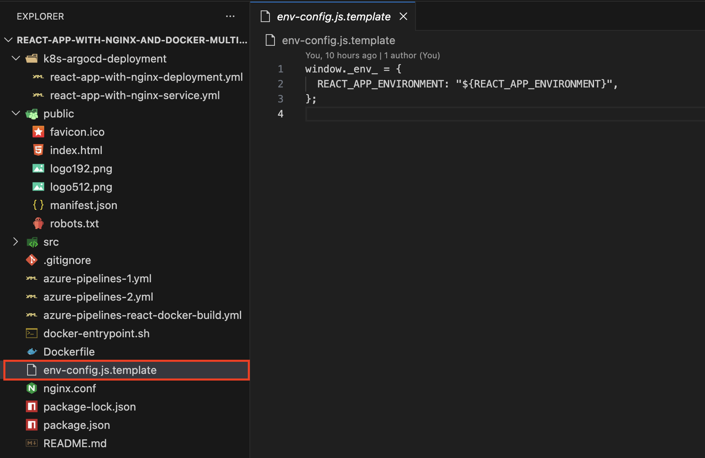
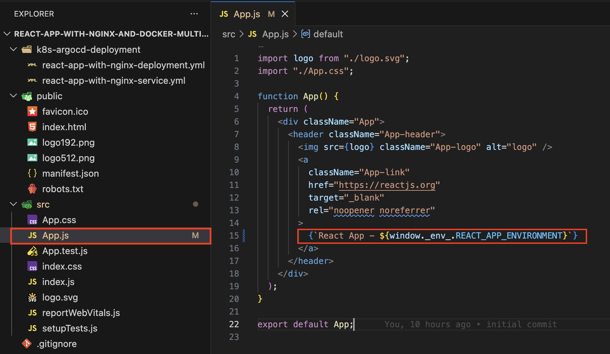
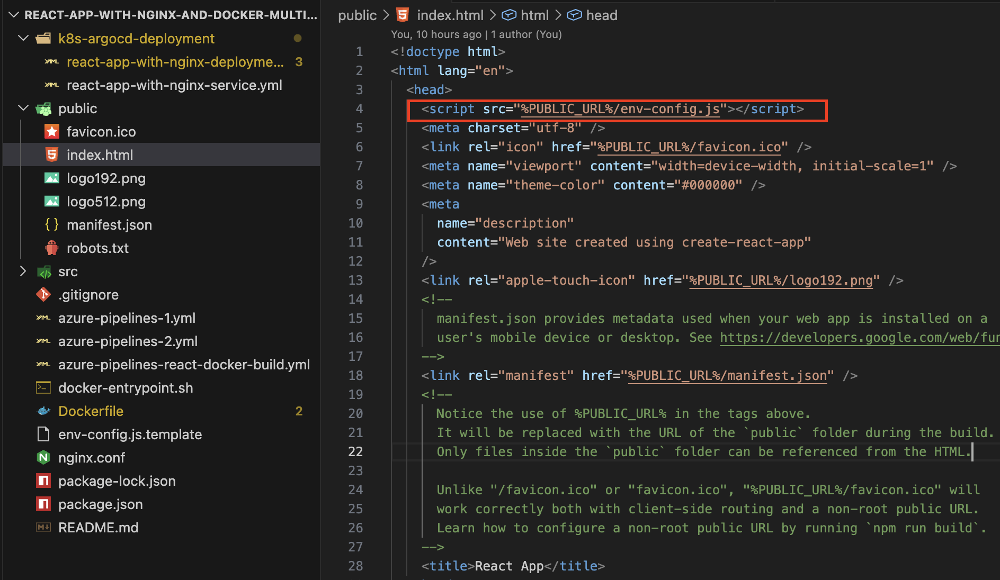

# React App with nginx and Docker multi stage build

1. When Dockerizing a React App with Nginx using Multi Stage Docker Build, follow below steps to set the env variables.

1. Create **env-config.js.template** file in root of the project and add required environment variables that need to be set dynamically.

   ```javascript
   window._env_ = {
     REACT_APP_ENVIRONMENT: "${REACT_APP_ENVIRONMENT}",
   };
   ```

   

1. Use **window.\_env\_.env_variable_name** to get it's value in React .js/.jsx file. In the example below, I have referred in App.js file

   ```javascript
   {
     `React App - ${window._env_.REACT_APP_ENVIRONMENT}`;
   }
   ```

   

1. Add below script tag in [index.html](./public/index.html) file under public folder

   ```html
   <script src="%PUBLIC_URL%/env-config.js"></script>
   ```

   

1. Create [Dockerfile](./Dockerfile) in the root of the project with below configuration

   ```dockerfile
   FROM node:alpine AS build
   WORKDIR /app
   COPY package.json /app/package.json
   RUN npm i
   COPY . /app/
   RUN npm run build

   # production environment
   FROM nginx:stable-alpine
   RUN apk add --no-cache gettext
   RUN rm /etc/nginx/conf.d/default.conf
   COPY nginx.conf /etc/nginx/conf.d/default.conf
   COPY --from=build /app/build /usr/share/nginx/html
   COPY env-config.js.template /usr/share/nginx/html/
   COPY docker-entrypoint.sh /
   RUN chmod +x /docker-entrypoint.sh
   ENTRYPOINT ["/docker-entrypoint.sh"]
   EXPOSE 80
   ```
